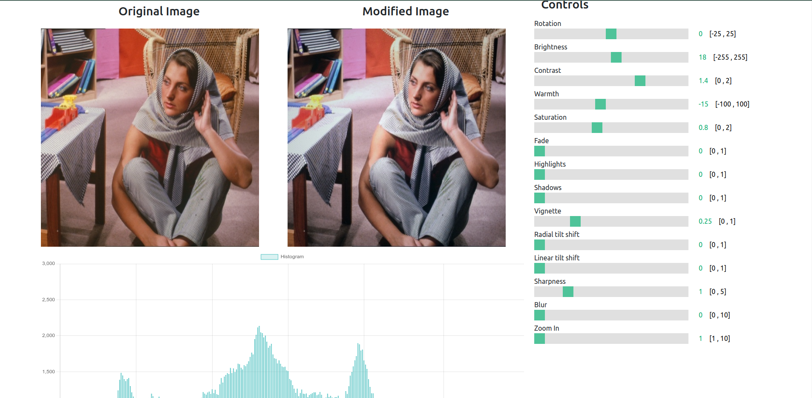

# Image Editor

This is a simple full-stack web application for editing images as a project for the course Introduction to image processing at the University of Novi Sad.
Application implements most common basic effects for image editing such as: brightness, contrast, blur, sharpen, radial and linear tilt shift, warmth, saturation, fade, highlihts, shadows, and more. All image processing is done using numpy and scipy libraries in Python. App also provides histogram for the image.
Front end is implemented using Angular, while back end is implemented using Django.

## Files

- `image_effects_backend/` - Django back end for the application
- `image_effects_frontend/` - Angular front end for the application
- `Images/` - Images used for presentation
- `IIP-Project.pptx` - Project presentation

## Demo Image
